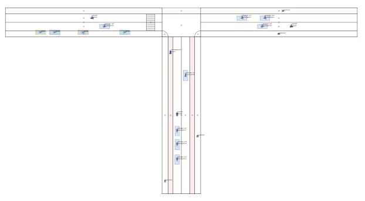
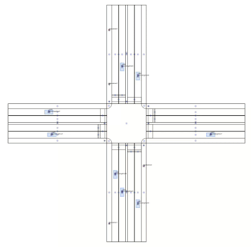

# The Traffic Ontology Benchmark (TOBM)

TOBM is a generator for temporal knowledge bases in the setting of scenario-based safeguarding of automated driving systems. 
The benchmark task is to answer four provided queries on the temporal knowledge bases produced by TOBM.
A temporal knowledge base consists of a list of standard knowledge bases, as defined by OWL2.
It is based on [`pyauto`](https://github.com/lu-w/pyauto) and the 
[Automotive Urban Traffic Ontology (A.U.T.O.)](https://github.com/lu-w/auto/).

## Artifacts

**Download**: You can download TOBM from [the latest release](https://github.com/lu-w/tobm/releases/latest).

### Data

TOBM produces randomized (`S`), scalable (`N`) traffic scenarios represented in A.U.T.O on an X-crossing and T-crossing setting.

  

  

For `N = 1..5` and `S = 0`, pre-computed data are already available in the [data](data) folder.

### Queries

The [query](query) folder contains four metric temporal conjunctive queries that can be evaluated on the data:

1. Intersecting vulnerable road user
2. Passing of parking vehicles on two-lane roads
3. Right turn
4. Lane change without a signal

## Overview

TOBM is takes both a seed `S` and a scaling parameter `N` as inputs.
It generates scenarios, i.e., measurement samples of traffic happenings of finite duration, from two settings:

1. A T-crossing setup with parking vehicles, a pedestrian crossing, and bikeway lanes, including pedestrians, 
bicyclists, and passenger cars. It has 8*N+22 individuals. 
One bicyclist is especially programmed to drive over the pedestrian crossing without granting right of way.
2. An X-crossing of two urban roads with traffic signs and dysfunctional traffic lights.
Compared to the T-crossing, there are no bicyclists and 5*N+69 individuals.

## Installation

TOBM requires Python >= 3.10.
First, initialize submodules: `git submodule update --init --recursive`.
Install the requirements of pyauto by navigating into `pyauto` and calling `pip install -r requirements.txt`.
Install the requirements of TOBM by calling `pip install -r requirements.txt` from this directory, and then this 
package via `pip install .`.

## Usage

After installation, `tobm` will be available from your command line.
Call `tobm --help` for further information.

We can generate an exemplary benchmark for N=1 and S=0 on the T-crossing with 10 Hertz and 20 second duration by
`tobm -r -n 1 -s 0 -d 20 -hz 10 -t t-crossing /tmp/mybenchmark`,
which saves the output files to `/tmp/mybenchmark` and renders the output using the visualizer of `pyauto`.

You can also later visualize the output if the `-g` flag was set on creation.
For this, just navigate into the directory and call `pyauto` on the generated `.kbs` file.

## Functioning

TOBM works by using defining behavior models for pedestrians, bicyclists, and vehicle drivers that operate using the simulation functionality of `pyauto`.
They are mainly defined in `tobm.sim_models.generic`, with some specific parametrization to the benchmark crossings in the respective submodules.
The scenarios can be enriched (augmented) using `-e`, which is based on  the `owlready2-augmentator`. 
It lifts the sampled data from concrete dynamical and geometrical information (e.g., positions, speeds) to abstract concepts and roles (e.g., positional relations).

Note that TOBM may generate accident scenarios sometimes, as simulation models are not perfect.
In this case, TOBM uses the next seed to generate a new scenario.
If you wish to generate accident scenarios without re-generation, turn on the `-a` flag.

The output is a list of classical OWL2-files, for compatibility with existing OWL-tooling.
That implies that each measurement sample (time point) is explicitly represented.
Each of these ABoxes imports a shared TBox, in case of TOBM, A.U.T.O.

TOBM can be extended to support various other scenario types easily by adding a new scenario to `tobm.scenario`, 
describing the scenery and the initial scene for the dynamically simulated individuals.
